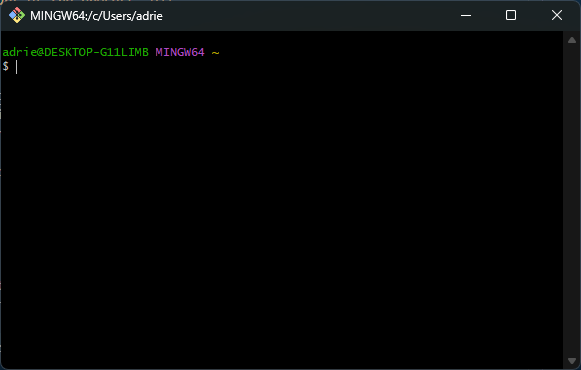
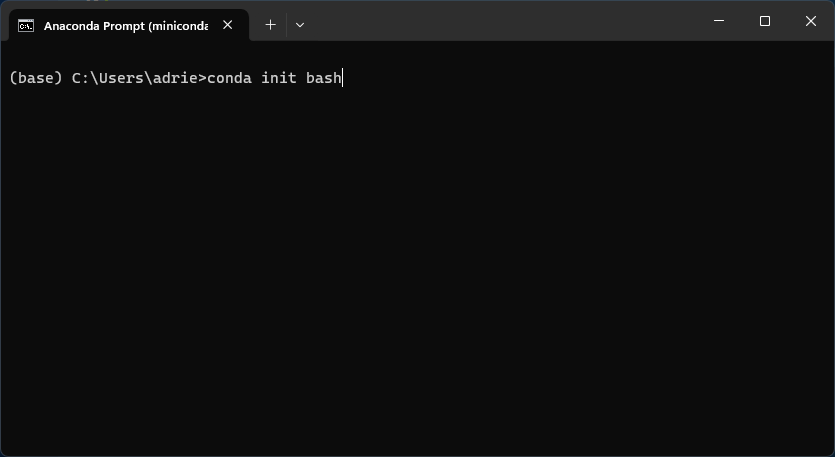

# How to install Python

<!-- easter egg caché
-->

First of all, there are several ways to install your python environment on your Windows computer, the following tutorial is just one setting that I find easy and clean enough to use.

## Prior installation

### Terminal

The default terminal in Windows is not that good to code, I don't recommend using it. To replace it, I advise you to install [Git Bash](https://gitforwindows.org/). It won't install you just a new terminal but also Git (code versionning software, required to use GitHub or GitLab among other things).

*Note: Accept all default parameters during installation (it sould be fine... your computer might crash but it's all part of the process ;D)*

### Miniconda

Although you could install python directly on your computer, I have found it best to use [Miniconda](https://docs.conda.io/projects/miniconda/en/latest/) as it comes with several attractive features like virtual environment management (we will come to that later). Download the only installer named `Miniconda3 Windows 64-bit` for Windows 

*Note: Accept all default parameters during installation.*

## Add Python to Git Bash

### Open Git Bash

On windows you can open `Git Bash` by finding the application using the search bar of your computer. It should open the following:



If you try typing:

```sh
conda --version
```

It will likely raise an error. To have access to conda and therefore python in you `Git Bash` terminal, you need to initialize it. To do so, close `Git Bash` open `Anaconda Prompt (miniconda3)` using your search bar and type:



It will display some stuff. Once done close the `Anaconda Prompt (miniconda3)`. When you reopen `Git Bash` you should see `(base)` displayed. It means conda is activated on this terminal:


Yet, `python` is not accessible, to make it so use:

```sh
echo "alias python='winpty python.exe'" >> ~/.bashrc
```

Close and reopen `Git Bash`. After typing `python` you should get:

